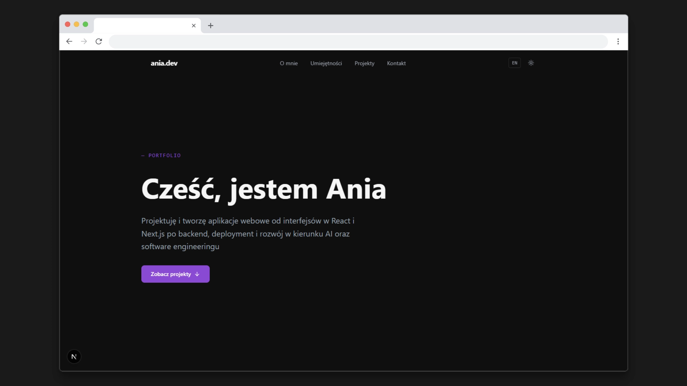
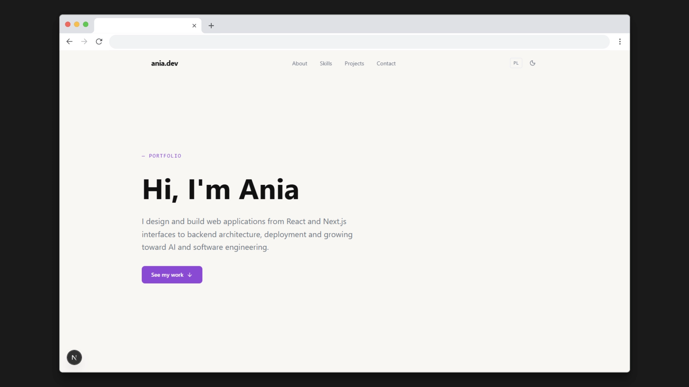
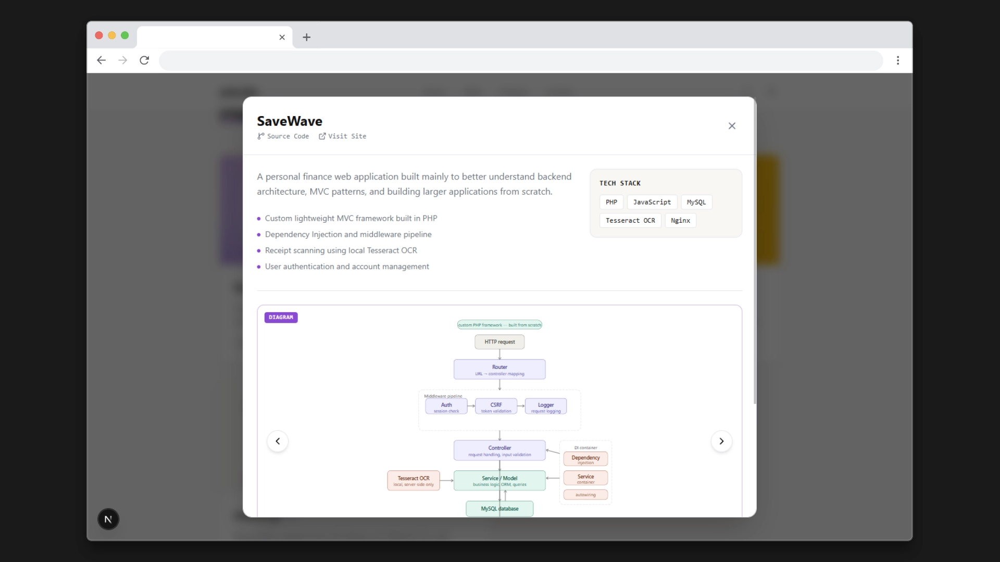

# anavers.pl — Portfolio

> Personal portfolio website built with **Next.js 16**, **TypeScript**, **Tailwind CSS v4**, and **Framer Motion**. Fully bilingual (Polish / English), dark/light mode, animated project modals with screenshot galleries.

**Live:** [anavers.pl](https://anavers.pl) · **Stack:** Next.js · TypeScript · Tailwind CSS v4 · Framer Motion · next-intl · Resend

---

## Screenshots

| Dark mode                                  | English version                        | Project modal                                |
| ------------------------------------------ | -------------------------------------- | -------------------------------------------- |
|  |  |  |

---

## Features

- **Bilingual (PL / EN)** — full i18n via `next-intl`, locale-based routing, automatic browser language detection
- **Dark / light mode** — flash-free on first load thanks to `next-themes` with `suppressHydrationWarning`
- **Animated project modals** — Framer Motion `AnimatePresence`, screenshot + architecture diagram galleries, dot & arrow navigation
- **Scroll-triggered animations** — reusable `ScrollReveal` component with `whileInView` (fadeIn, slideUp, slideLeft, slideRight variants)
- **Contact form** — client-side + server-side validation, sent via [Resend](https://resend.com), HTML email template
- **SEO** — Next.js Metadata API, Open Graph, Twitter Card, `sitemap.ts`
- **Component architecture** — every UI piece is split into focused, single-responsibility components

---

## Tech Stack

| Layer      | Technology                                     |
| ---------- | ---------------------------------------------- |
| Framework  | Next.js 16 (App Router)                        |
| Language   | TypeScript                                     |
| Styling    | Tailwind CSS v4 (CSS-first config)             |
| Animations | Framer Motion 12                               |
| i18n       | next-intl 4                                    |
| Theming    | next-themes                                    |
| Icons      | Lucide React                                   |
| Email      | Resend                                         |
| Hosting    | DigitalOcean Droplet + Nginx + PM2             |
| Fonts      | Sora · DM Sans · JetBrains Mono (Google Fonts) |

---

## Project Structure

```
anavers/
├── messages/
│   ├── pl.json               # Polish translations
│   └── en.json               # English translations
├── public/
│   └── projects/             # Project screenshots & diagrams
└── src/
    ├── app/
    │   ├── [locale]/
    │   │   ├── layout.tsx    # Root layout — fonts, ThemeProvider, NextIntlClientProvider
    │   │   └── page.tsx      # Home page — metadata + section composition
    │   ├── api/contact/
    │   │   └── route.ts      # POST handler — validation, sanitization, Resend
    │   └── sitemap.ts
    ├── components/
    │   ├── layout/
    │   │   ├── Navbar.tsx    # Fixed navbar — language switcher, theme toggle, mobile hamburger
    │   │   └── Footer.tsx
    │   ├── sections/
    │   │   ├── Hero.tsx
    │   │   ├── About.tsx
    │   │   ├── Skills.tsx
    │   │   ├── Projects.tsx
    │   │   └── contact/
    │   │       ├── Contact.tsx          # Layout wrapper
    │   │       ├── ContactForm.tsx      # Smart component — state, validation, API call
    │   │       ├── ContactFormFields.tsx # Presentational — form fields
    │   │       └── ContactSuccess.tsx   # Success state
    │   └── ui/
    │       ├── ProjectCard.tsx          # Smart container — modal state, slide logic
    │       ├── ProjectCardThumbnail.tsx
    │       ├── ProjectCardBody.tsx
    │       ├── ProjectModal.tsx         # Modal structure — overlay + window
    │       ├── ProjectModalHeader.tsx
    │       ├── ProjectModalContent.tsx
    │       ├── ProjectModalGallery.tsx
    │       ├── ModalAnimate.tsx         # Framer Motion wrapper
    │       └── ScrollReveal.tsx         # Reusable scroll animation wrapper
    ├── lib/
    │   ├── data.ts            # Projects & skills data (typed)
    │   ├── routing.ts         # next-intl routing config
    │   └── request.ts         # next-intl server config
    └── middleware.ts           # next-intl locale middleware
```

---

## Getting Started

### Prerequisites

- Node.js **≥ 20.9.0** (see `.nvmrc`)
- npm 10+

```bash
# Use the correct Node version (if using nvm)
nvm use
```

### Installation

```bash
git clone https://github.com/ania-sk/anavers.git
cd anavers
npm install
```

### Environment variables

Create `.env.local` in the project root:

```env
# Resend API key — https://resend.com/api-keys
RESEND_API_KEY=re_xxxxxxxxxxxxxxxxxxxx

# Recipient email address for contact form submissions
CONTACT_EMAIL=your@email.com
```

> `.env.local` is listed in `.gitignore` — never commit it.

### Development

```bash
npm run dev
```

Open [http://localhost:3000](http://localhost:3000). The app will redirect to `/pl` or `/en` based on browser language.

### Production build

```bash
npm run build
npm run start
```

---

## Internationalization

All UI strings live in `messages/pl.json` and `messages/en.json`. The routing middleware (`src/middleware.ts`) intercepts requests and applies the correct locale prefix (`/pl/*`, `/en/*`). The language switcher in the Navbar uses next-intl's typed `Link` with `locale` prop — no page reload.

To add a new locale:

1. Add the locale to `routing.ts` → `locales` array
2. Create `messages/<locale>.json`
3. Update the `middleware.ts` matcher pattern

---

## Adding a New Project

1. Add an entry to `projectsData` in `src/lib/data.ts`
2. Add translation keys to both `messages/pl.json` and `messages/en.json`:
   - `<slug>_desc` — short description shown on the card
   - `<slug>_h1`, `<slug>_h2`, … — highlights (modal bullet points)
   - `<slug>_slide_<descKey>` — caption for each gallery slide
3. Place screenshots in `public/projects/` and reference them in the `slides` array
4. Slides support `type: "screenshot"` (default) or `type: "diagram"` — diagrams render with `object-contain` and an accent border

---

## Deployment (DigitalOcean)

The site runs on a DigitalOcean Droplet with Nginx as a reverse proxy and PM2 as a process manager.

```bash
# On the server
git pull origin main
npm ci
npm run build
pm2 restart anavers
```

Nginx forwards port 80/443 → 3000. SSL is handled by Certbot (Let's Encrypt).

```nginx
server {
    listen 443 ssl;
    server_name anavers.pl www.anavers.pl;

    location / {
        proxy_pass http://localhost:3000;
        proxy_set_header Host $host;
        proxy_set_header X-Real-IP $remote_addr;
    }
}
```

---

## Contact Form

The `/api/contact` Route Handler:

1. Parses the JSON body
2. Validates server-side (name ≥ 2 chars, valid email regex, message ≥ 10 chars)
3. Sanitizes all fields (HTML entity encoding — no XSS)
4. Sends a styled HTML email via the Resend API
5. Returns `200` on success or `400/500` with an error message

The contact form on the frontend also runs the same validation client-side before making the API call, giving instant feedback without a round-trip.

---

## License

MIT — feel free to use this as a template or inspiration for your own portfolio.

---

<p align="center">
  Built with Next.js &amp; ☕ by <a href="https://anavers.pl">Ania-Sk</a>
</p>
